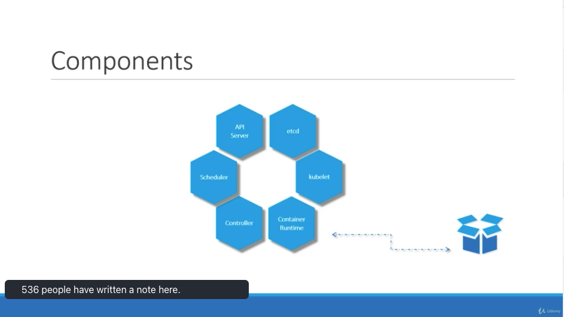

# Kubernetes Architecture

# Table of Contents

1. [Node vs Cluster](#NodeCluster)
2. [Components](#Components)
3. [Master vs Worker Node](#MasterWorker)

## Componenets<a name="Components" />

`Node` is a physical/virtual machine on which the kubernetes is installed.
Node crash than must have more than one node.

`Cluster` is the set of nodes.

## Components<a name="Components" />

- `Api Server`: Works as the frontent for the kubernetes. 
- `etcd`: Distributed reliable key value store to store all data used to manage the cluster. Responseible for logging.
- `Scheduler`: Responsible for distributing work or containers across multiple nodes
- `Controller`: Brain behind orchestration. Noticing and responsible when node/endpoint goes down.
- `Container Runtime`: constainer runtime: underlying framework that is responsible for running application in containers like Docker
- `kubelet`: Agent in each worker node, responsible for making sure the worker node is running.

## Master vs Worker Node<a name="MasterWorker" />

The structure above describes the different components of worker and master node.

