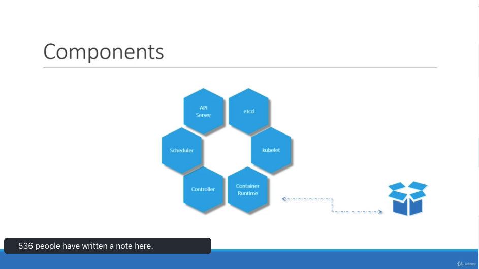
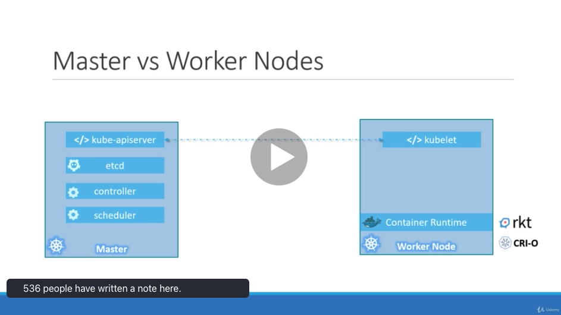

# Kubernetes Architecture

# Table of Contents

1. [Node vs Cluster](#NodeCluster)
2. [Node Components](#Components)
    1. [Master vs Worker Node](#MasterWorker)
3. [Workloads](#Workloads)

## Components<a name="Components" />

`Node` is a physical/virtual machine on which the kubernetes is installed.
Node crash than must have more than one node.

`Cluster` is the set of nodes.

## Node Components<a name="Components" />

- `Api Server`: Works as the frontent for the kubernetes. 
- `etcd`: Distributed reliable key value store to store all data used to manage the cluster. Responseible for logging.
- `Scheduler`: Responsible for distributing work or containers across multiple nodes
- `Controller`: Brain behind orchestration. Noticing and responsible when node/endpoint goes down.
- `Container Runtime`: Underlying framework that is responsible for running application in containers like Docker
- `kubelet`: Agent in each worker node, responsible for making sure the worker node is running.

### Master vs Worker Node<a name="MasterWorker" />

The structure above describes the different components of worker and master node.

## Workloads<a name="Workloads" />

A `workload` is an application running on Kubernetes. Whether your workload is a single component or several that work together, on Kubernetes you run it inside a set of `Pods`. Kubernetes pods have a defined lifecycle, and `workload resources` are there to manage a set of pods on your behalf.

Kubernetes provides several built-in workload resources:

- `Deployment` and `ReplicaSet`
- `StatefulSet`
- `DaemonSet`
- `Job` and `CronJob`