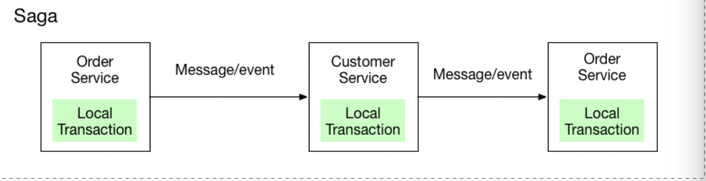
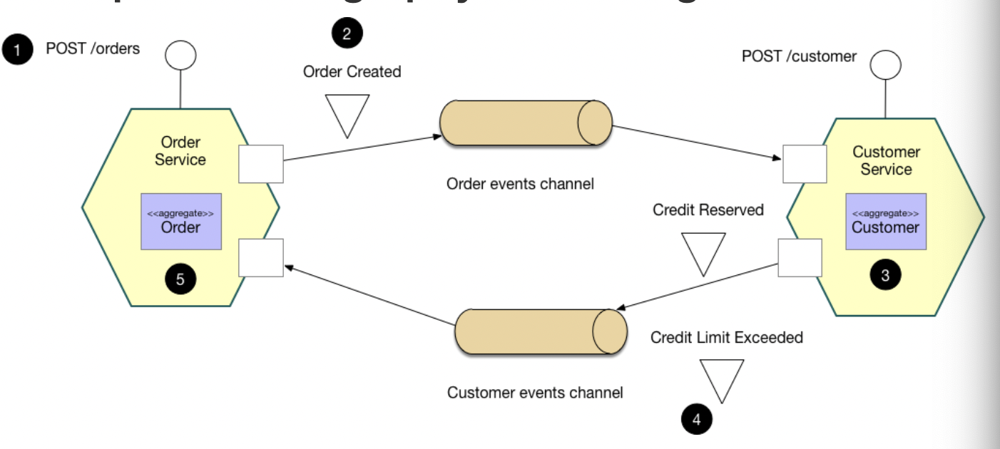
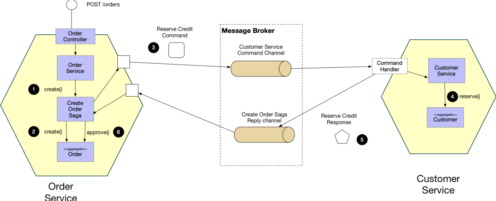

# Data Management

# Table of Contents

1. [Why?](#Why)
2. [Antipattern: Shared Database](#Antipattern)
3. [Database Per Service](#DBPerService)
4. [Saga Pattern](#SagaPattern)
    1. [Choreography-based SAGA](#Choreography)
    2. [Orchestration-based SAGA](#Orchestration)
    3. [Choreography vs Orchestration](#VS)
5. [CQRS](#CQRS)

## Why?<a name="Why" />

Modern software systems are operated via more than one service, and it is critical that each service are loosely coupled so that they can be developed, deployed and scaled independently. Some services might have logics that are dependent on other systems. It is thus critical to know how to construct the relationships/communication bewteen services in microservice architecture.

## Antipattern: Shared Database<a name="Antipattern" />

`Shared Database` is a pattern where multiple services share a single database. Each service freely accesses data owned by other services using local ACID transactions. However, there are drawbacks of this pattern:

- `Development time coupling`: A developer working on, for example, the `OrderService` will need to coordinate schema changes with the developers of other services that access the same tables. This requires a lot of database migration, and thus will slow down development.

- `Runtime coupling`: Because all services access the same database, they can potentially interfere with one another.

## Database per Service<a name="DBPerService" />

As the word suggests, this pattern is keeping each microservice's persistent data private to that service and accessible only via its API. A service's transactions only involve its database.

This brings the following benefits:
- Helps ensure that the services are loosely coupled.
- Each service can use the type of database(ex. relational vs non-relational) that is best suited to its needs.

This brings the following drawbacks:
- Implementing business transactions that span multiple services is not straightforward. Distributed transactions are best avoided because of the CAP theorem.
- Implementing queries that join data that is now in multiple databases is challenging.

To achieve Database per service, we need to implement transactions and queries that span services.

- Implementing transactions that span services: `SAGA Pattern`
- Implementing queries that span services: `API Compoistion` & `CQRS`.

## Saga Pattern<a name="SagaPattern" />

A `SAGA` is a sequence of local transaction. Each local transaction updates the database and publishes a message or event to trigger the next local transactions in the saga. If a local transaction fails because it violates a business rule then the saga executes a series of compensating transactions that undo the changes that were made by the preceding local transactions.

### Choreography-based SAGA<a name="Choreography" />

Each local transaction publishes domain events that trigger local transactions in other services.

### Orchestration-based SAGA<a name="Orchestration" />

An orchestrator tells the participants what local transactions to execute.

### Choreography vs Orchestration<a name="VS" />

In `Choreography` based SAGA, there are multiple point-to-point communication, and each service will be 100% dependent on the other one. Moreover, due to the nature of having multiple point-to-point communication, if the size of the software system becomes larger, it is incredibly difficult to debug & test the entire process. Compared to `Orchestration` based SAGA, it is much easier to implement if the software system is not that complex.

## CQRS<a name="CQRS" />

`CQRS`, short for command query responsibility segregation, is a pattern that separates read and update operations for a data store. To be more specific, it uses commands to update data and queries to read data. 

- Commands should be task-based rather than data centric. ("Book hotel room(o)", "Set ReservationStatus to Reserved(x)")
- Queries never modify the database. A query returns a DTO that does not encapsulate any domain knowledge.

If separate read and write databases are used, they must be kept in sync. Typically this is accomplished by having the write model publish an event whenever it updates the database. Updating the database and publishing the event must occur in a single transaction.

Most CQRS implementation often employ `Event Sourcing Pattern`. With this pattern, application state is stored as a sequence of events. Each event represents a set of changes to the data. 

With CQRS, the benefits are:

- `Independent Scaling`: CQRS allows the read and write workloads to scale independently, and my result in fewer lock contentions.
- `Optimized data schemas`: The read side can use a schema that is optimized for queries, while the write side uses a schema that is optimized for updates.
