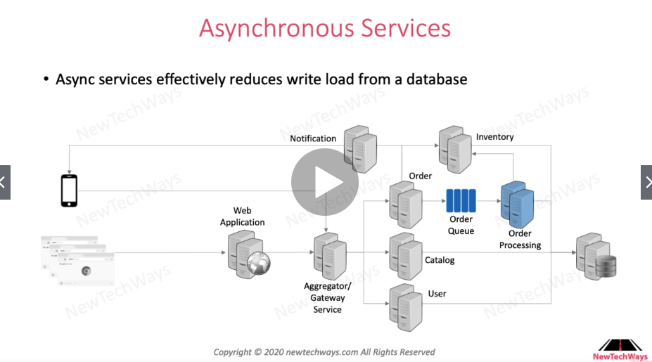
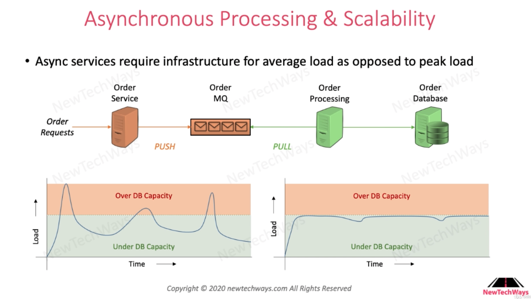

# Asynchronous Processing

# Table of Contents

1. [When to use?](#When)
2. [Asynchronous Processing](#Async)
## When to use?<a name="When" />

Async services(such as `message queues`) effectively reduce write load from a database. Asynchronous Processing in scaling is effective when the operation barely requires client response and is heavy on database write.

## Asynchronous Processing <a name="Async" />

Message queue can scale higher than databases i.e. it is easier to scale message queue. Thus, using message queue(asyncrhonous processing) allows our database to handle peaking ocurrences of loads. Note that load is not stable. It can vary severly by time.