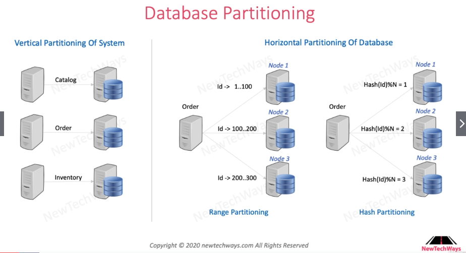

# Database Partitioning

# Table of Contents

1. [Vertical Scaling in Microservices](#Vertical)
2. [Horizontal Database Paritioning](#HDBPartition)
3. [Routing with Database Partitioning](#Routing)

## Vertical Scaling in Microservices<a name="Vertical" />

Instead of multiple services sending load to a single database, we can use vertical scaling so that each services is responsible for a single database. This however, comes with a sacrifice, which is that `ACID` transaction is no longer viable.

## Horizontal Database Paritioning<a name="HDBPartition" />

Vertical Partitioning is not without limits. In vertical scaling, the scaling cost is linear. This can be reduced by horizontal partitioning. Some of the methods of horizontal partitioning is `range partitioning` and `hash partitioning`. These are mostly used for noSQL database. 

- `Range Partitioning`: Range query is viable. Nodes are maintained by tree structure, and performance is worse than `Hash Partitioning`.
- `Hash Partitioning`: Range query is not viable. Performance is better than `Range Partitioning`.

## Routing with Database Partitioning<a name="Routing" />

First is the usage of database's client library.  

Second is the usage of `Router`, which is the method used by databases like `MongoDB`.  

Third is the auto redirection, method used by databases like `DynamoDB` or `CassandraDB`.