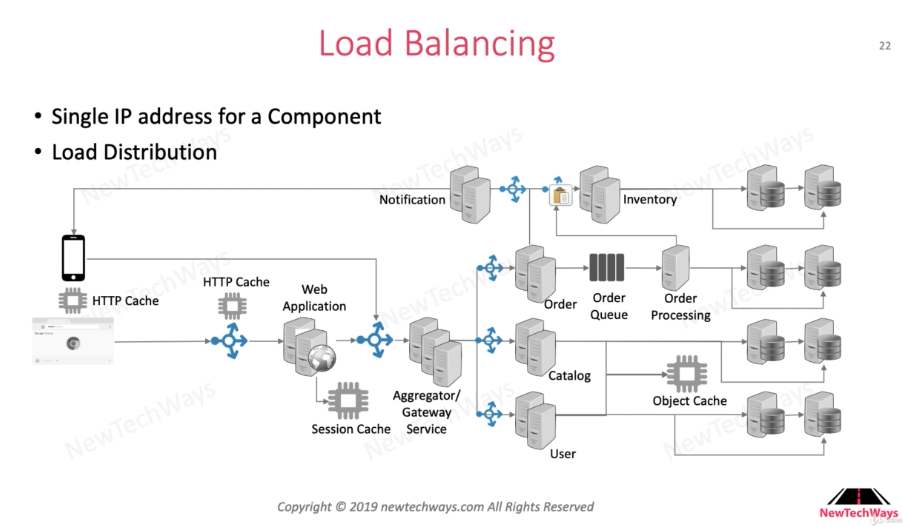
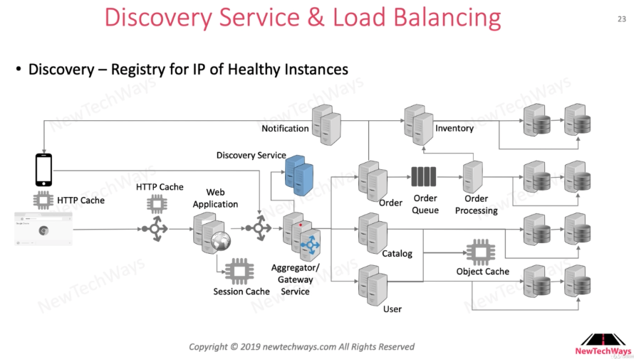
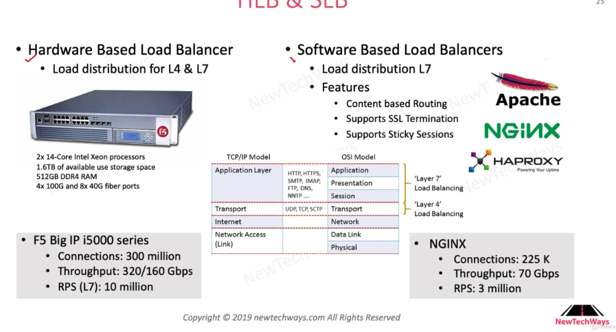

# Load Balancing

# Table of Contents

1. [What is Load Balancing?](#What)
2. [Discovery Service](#DiscoveryService)
3. [HLB vs SLB](#HLBSLB)

## What is Load Balancing?<a name="What" />

Load balancer is responsible for distributing loads to components. Client thus only need to know a single IP address for the service it wants to connect, which is the IP address of the load balancer.

## Discovery Service<a name="DiscoveryService" />

Discovery service is a registry for IP of Healthy Instances.

Embedded load balancing in the API Gateway uses discovery service to load balance.

## HLB vs SLB<a name="HLBSLB" />

Note that hardware based load balancer is way more expensive than software based load balancer.