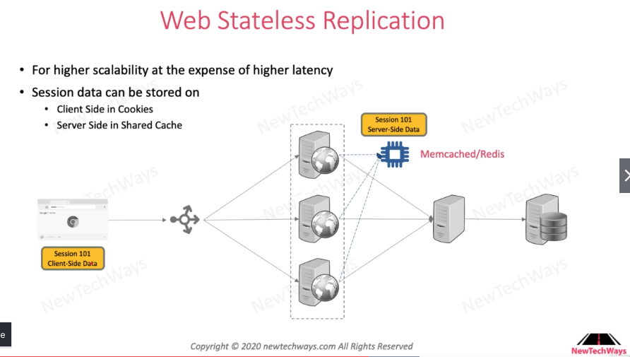
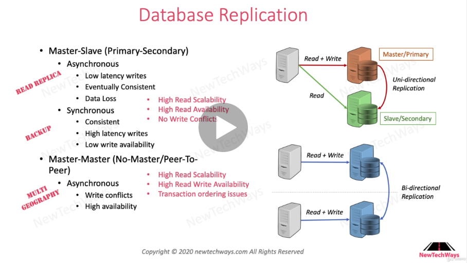

# Scalabilty

# Table of Contents

1. [What is Scalability](#What)
2. [Vertical & Horizontal Scaling](#VerticalHorizontal)
3. [Horizontal Scaling](#Horizontal)
    1. [Reverse Proxy](#ReverseProxy)
    2. [Replication](#Replication)
        1. [Stateful](#Stateful)
        2. [Stateless](#Stateless)
4. [Scalability Principle](#ScalabilityPrinciple)

## What is Scalability<a name="What" />

Scalability is the property of a system to handle a growing amount of work by adding resources to the system.

## Vertical vs Horizontal Scaling<a name="VerticalHorizontal" />

`Horizontal` is adding more machines aka "scaling out".
`Vertical` is adding more power, such as CPU, RAM to an existing machine aka "scaling up".

`Horizontal Scaling` requires breaking a sequential piece of logic into smaller pieces that are
executed parallely in different machines. There are several patterns associated with this model:
`Master/Worker`, `Tuple Spaces`, `Blackboard`, `MapReduce`. 

## Horizontal Scaling<a name="Horizontal" />

### Reverse Proxy<a name="ReverseProxy" />

Instead of client having to remember addresses of multiple servers in horizontal scaling, reverse proxy allows
the client to achieve horizontal scaling by remembering only one ip address, the address of the reverse proxy.

### Replication<a name="Replication" />

Replication is used to handle increasing workloads
- `stateless`: code e,g, web servers, backend servers
- `stateful` : code & data replication, e.g, DBMS + certain cases of web servers.

#### Stateful<a name="Stateful" />

Done when low latency is required.

- `Sticky Sessions`/`Session Affinity`: In web servers, client remembers which web server it accessed through sessions. However, sessions occupy memory and session get clustered, hazarding the reliability.

#### Stateless<a name="Stateless" />

Done for higher scalability at the expense of higher latency.
 
<b>Web Server</b>

No session is used to store data in the web server. Thus, latency must increase since when a client sends
a request, it has to go all the way back to the database layer.
 

To resolve this issue, it is preferred to use `memcached` or `redis`. Thus, the sessions/cookies that were 
stored in the web serer in stateful replication is divded as such.

- Cookies in client side
- Shared cache in server side.

 
<b>Backend Server</b>

It is almost identical to web server stateless replication. The difference is that multi-threading that was
done in backend server has to be done in a different way. One way of doing this is creating a lockfile of threads in the database server.

 
<b>Database</b>

In terms of RDBMS, it can use master-slave replica structure. Read replica is used for higher read scalability, and backup database is created for higher availability.

There are different types of database replication. 

First is the `master-slave`, also known as `primary-secondary` replication.  
Servers

Second is the `master-master`, also known as `peer-to-peer`.
## Scalability Principle<a name="Scalability Principle" />

- `Decentralization`: One component is not responsible for all work. Thus, monolith is an antipattern for scalability. In monolith application, only vertical scaling is viable.

- `Independence`: Multiple workers are no good if they cannot work independently. Independence is impeded by shared resource, shared mutable data

- `Modularity`: Business logic should be modular, i.e. loosely coupled or decoupled. Also, the service modules should be seperate from the `API Protocol Layer` and `Data Access Layer`.